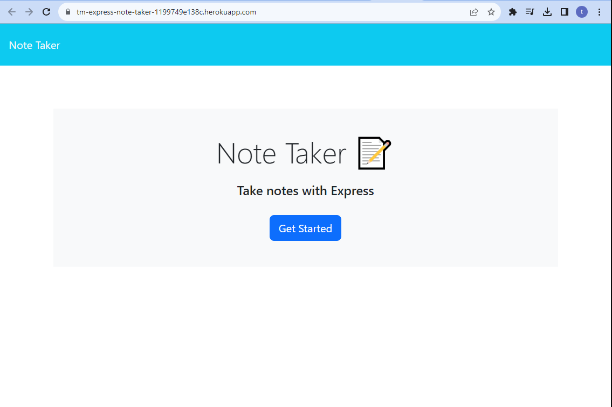

# Express.js Note Taker

## Heroku Website Link

https://tm-express-note-taker-1199749e138c.herokuapp.com/

## Description

This is the 11th Module project for the 11th week of the UCB Coding bootcamp, this week we focused on learning Express.js. For this project we were given some starter code, the html, css and js for a note taking website, and were asked to code the back end with express, and deployed to heroku. 

## Table of Contents
- [Description](#description)
- [WebsiteSS](#Screenshot)
- [Installation](#installation)
- [Usage](#usage)
- [License](#license)
- [Tests](#tests)
- [Questions](#questions)

## Screenshot 

## Installation

No installation required, simply accest the heroku website link. 

## Usage 

This can be used to have an effecient and easy to manage note taking website, as well as I can look back on this application to study the basics of express, and heroku deployment.

## Tests

N/A
## Questions

For any questions, reach out to [notUnEeVeN](https://github.com/notUnEeVeN) or [email me](mailto:tybalt.mallet@gmail.com).
